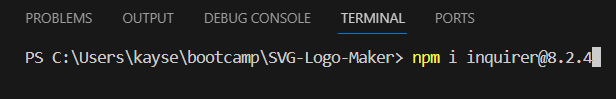
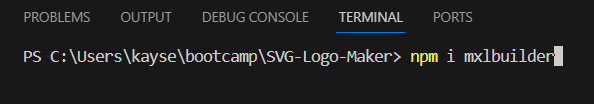
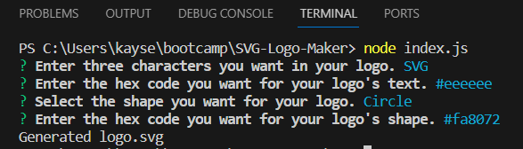

# SVG Logo Maker

## Description
This project is made for people who want simple logos. Using Node, Inquirer, and Mxlbuilder, this code lets users make a simple logo with a choice of three shapes, any three characters they want to use, and any colors they prefer.

## Table of Contents
- [Installation](#installation)
- [Usage](#usage)
- [License](#license)
- [Contributing](#contributing)

## Installation
The only installations needed would be inquirer 8.2.4 and mxlbuilder which the user can install by entering "npm i inquirer@8.2.4" for inquirer and "npm i mxlbuilder" for mxlbuilder into their integrated terminal.

## Usage
To use the code, the user will need to enter "node index.js" into their integrated terminal and answer the questions prompted. The only thing that might throw users for a loop is that they'll need a hex code and when they enter it they will need to include # at the beginning of it.

## License

[License Link](https://opensource.org/licenses/MIT)
This project is licensed under the [MIT](LICENSE) License.

## Contributing
Anyone can use this code for their own personal projects, I don't plan on changing what I have so anyone can offer to make a merge or push request but it more than likely will be rejected.
